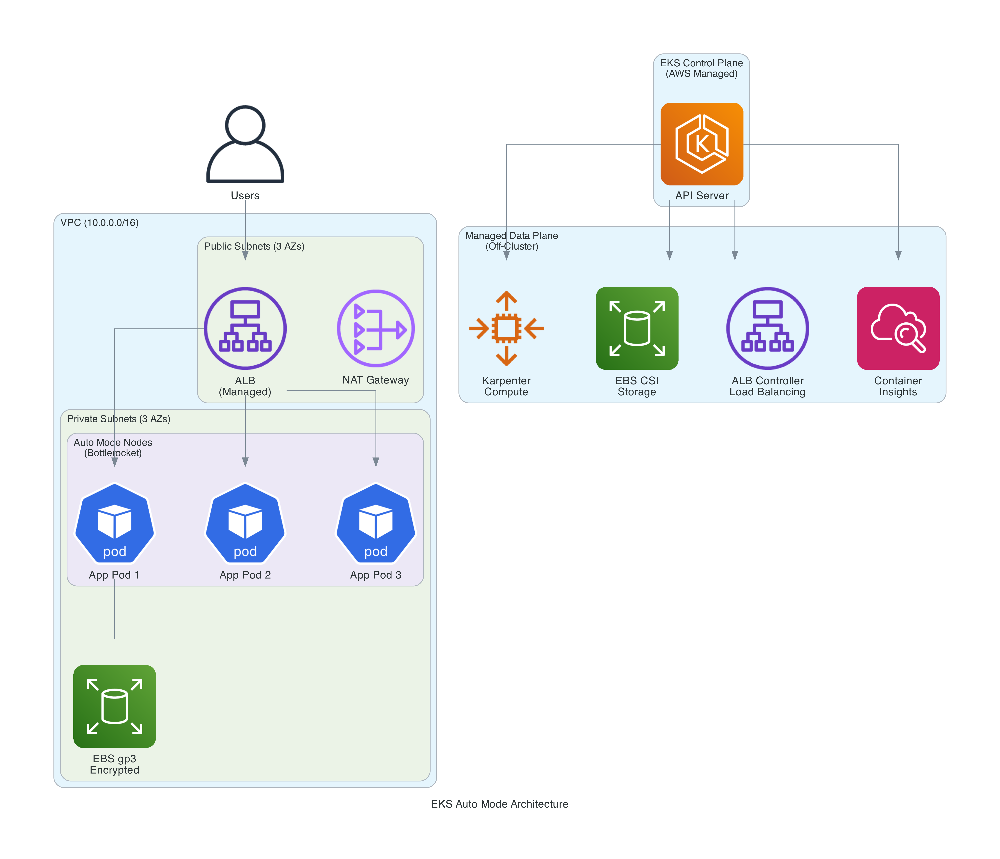
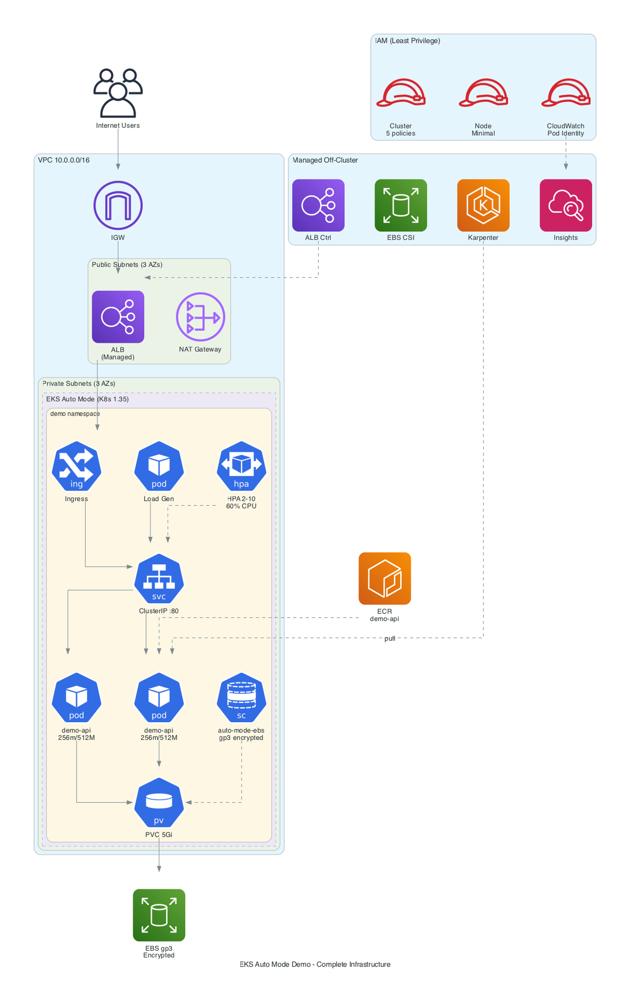
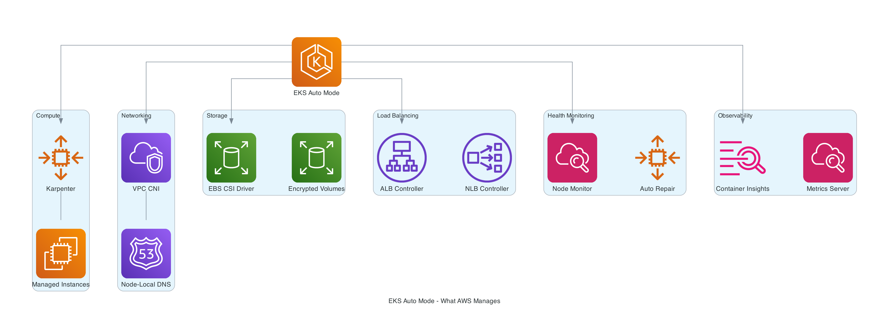
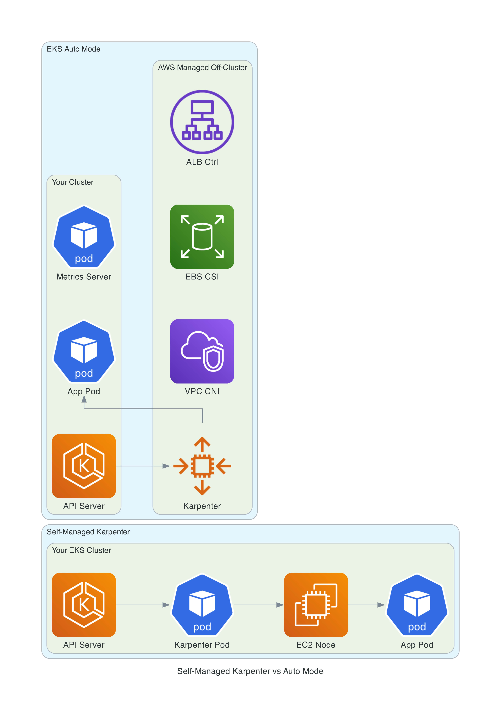
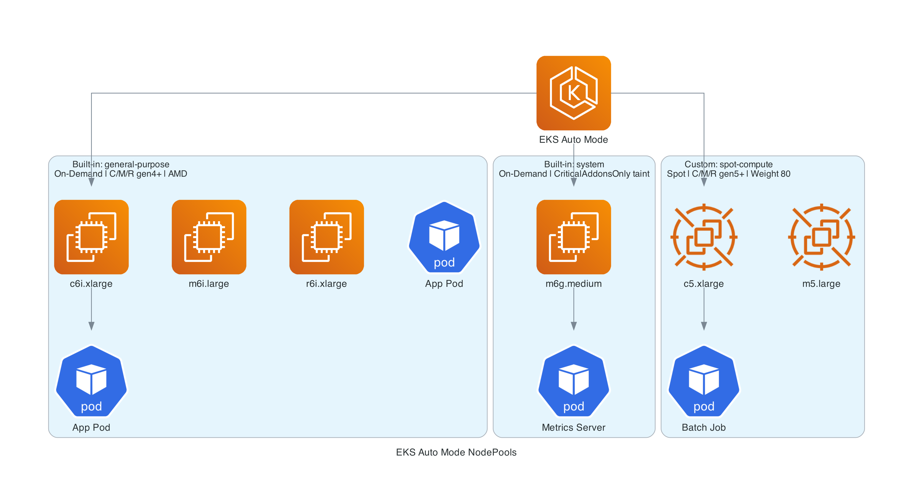
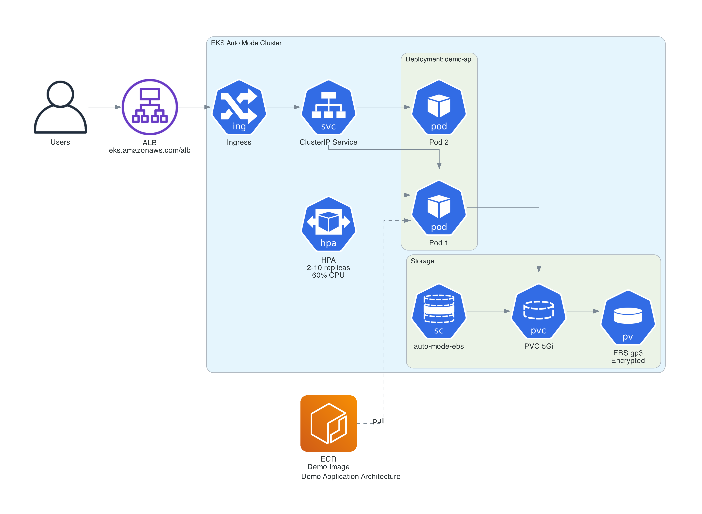
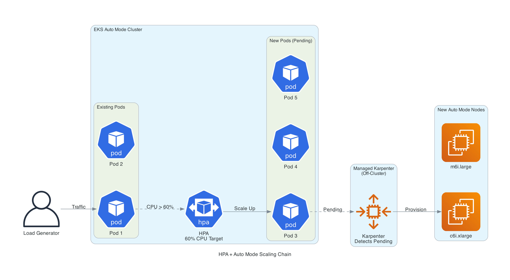
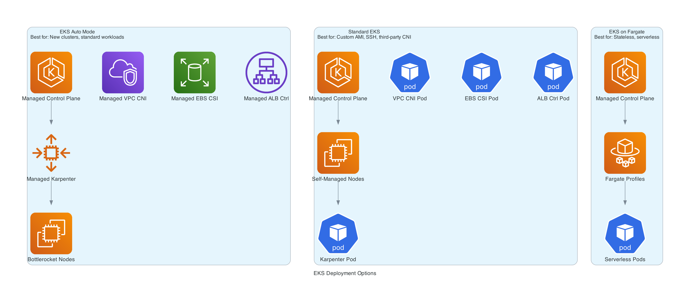

# EKS Auto Mode with Terraform - Production-Ready Setup

A complete, deployable EKS Auto Mode cluster using Terraform. Demonstrates the key features of Auto Mode: managed compute with Karpenter, automatic node scaling, managed storage and load balancing, Container Insights observability, security hardening, and cost optimization with Spot NodePools.

Companion blog post: [EKS Auto Mode with Terraform: Production-Ready Setup Guide](https://darryl-ruggles.cloud/a-complete-terraform-setup-for-eks-auto-mode-is-it-right-for-you)

## What is EKS Auto Mode?

EKS Auto Mode delegates the entire data plane to AWS - compute (Karpenter), networking (VPC CNI), storage (EBS CSI), load balancing (ALB/NLB Controller), and node health monitoring. The only pods running in your cluster are the Kubernetes Metrics Server. Everything else runs off-cluster as managed services.

## Architecture



The complete infrastructure created by this repo:



## Prerequisites

- [Terraform](https://developer.hashicorp.com/terraform/install) >= 1.10
- [AWS CLI](https://docs.aws.amazon.com/cli/latest/userguide/getting-started-install.html) v2 configured with credentials
- [kubectl](https://kubernetes.io/docs/tasks/tools/)
- [Docker](https://docs.docker.com/get-docker/) with buildx (for multi-arch builds)

## Quick Start

```bash
# 1. Clone and initialize
git clone https://github.com/RDarrylR/eks-auto-mode-terraform.git
cd eks-auto-mode-terraform

# 2. (Optional) Customize variables
cp terraform/terraform.tfvars.example terraform/terraform.tfvars
# Edit terraform/terraform.tfvars as needed

# 3. Deploy infrastructure
make init
make plan
make apply

# 4. Configure kubectl
make configure-kubectl

# 5. Build and push the multi-arch demo app image
make docker-build

# 6. Deploy the application
make deploy-app

# 7. Check status
make status
```

## What Gets Created

| Resource | Details |
|----------|---------|
| VPC | 3 AZs, public + private subnets, single NAT gateway |
| EKS Cluster | Auto Mode enabled, Kubernetes 1.35 |
| Built-in NodePools | `general-purpose` (On-Demand) + `system` (with taint) |
| Custom Spot NodePool | C/M/R gen 5+, 60-70% savings for fault-tolerant workloads |
| Container Insights | CloudWatch observability addon with Pod Identity |
| ECR Repository | For the demo app container image |
| Demo Application | FastAPI API with /info (scheduling details), /compute (CPU stress), /stress (memory), ALB, HPA, and load generator |

## File Structure

```
terraform/
  providers.tf           # AWS, Kubernetes, kubectl providers
  variables.tf           # Input variables with defaults
  main.tf                # VPC + EKS cluster with Auto Mode + metrics-server + Container Insights
  nodepools.tf           # Custom Spot NodePool (Karpenter config)
  loadbalancer.tf        # IngressClassParams + IngressClass + Ingress (Terraform-managed)
  observability.tf       # CloudWatch IAM role for Pod Identity
  ecr.tf                 # ECR repository
  outputs.tf             # Cluster and ECR outputs
  terraform.tfvars.example
k8s/
  namespace.yaml         # Demo namespace
  rbac.yaml              # ServiceAccount + ClusterRole for /info node label reads
  deployment.yaml        # FastAPI deployment (2 replicas, downward API env vars)
  service.yaml           # ClusterIP service
  ingress.yaml           # ALB ingress (internet-facing)
  ingressclass.yaml      # IngressClassParams + IngressClass
  hpa.yaml               # HPA (2-10 replicas, 60% CPU, 120s stabilization)
  pdb.yaml               # PodDisruptionBudget (minAvailable: 1)
  load-generator.yaml    # Load generator for scaling demos
app/
  main.py                # FastAPI demo (/health, /info, /compute, /stress)
  requirements.txt       # Python dependencies
  Dockerfile             # Container image
diagrams/                # Architecture and feature diagrams
Makefile                 # Build, deploy, and scaling demo commands
```

## Key Features Demonstrated

### Managed Compute (Karpenter)



Auto Mode runs Karpenter off-cluster as a managed service. Nodes are provisioned automatically based on pod resource requests, consolidated when underutilized, and replaced every 14 days (max 21 days) with patched Bottlerocket AMIs.



### Custom NodePools



The built-in `general-purpose` pool uses On-Demand instances only. A custom Spot NodePool provides 60-70% savings for fault-tolerant workloads using C/M/R instance families (gen 5+, AMD and ARM/Graviton).

### Demo Application



A FastAPI application with four endpoints:
- `/health` - Health check for probes and ALB
- `/info` - Returns pod and node details (instance type, Spot/On-Demand, NodePool, AZ, architecture)
- `/compute/{iterations}` - CPU-intensive endpoint for HPA scaling demos
- `/stress/{mb}?seconds=30` - Memory allocation for pressure demos

### Autoscaling



The repo includes everything needed to demonstrate pod and node autoscaling. The HPA scales on both CPU (60%) and memory (70%):

```bash
# Scale pods manually - watch Auto Mode provision new nodes
make demo-scale-up      # Scale to 15 replicas
make demo-watch         # Watch HPA, pods, nodes, and events
make demo-scale-down    # Scale back to 2, watch consolidation

# CPU-driven scaling - load generator hits /compute/500000
make demo-load-start    # Deploy load generator
make demo-watch         # Watch HPA scale pods, Auto Mode scale nodes
make demo-load-stop     # Remove load, watch scale-down

# Memory-driven scaling - /stress endpoint allocates memory
curl "http://<ALB_URL>/stress/256?seconds=120"  # Repeat to stack pressure
```

### Security
- **Bottlerocket OS** - minimal, hardened, SELinux enforcing, read-only root filesystem
- **IMDSv2 enforced** - hop limit of 1, prevents container credential theft
- **Encrypted EBS** - StorageClass configured with `encrypted: "true"`
- **Least-privilege IAM** - `AmazonEKSWorkerNodeMinimalPolicy` + `AmazonEC2ContainerRegistryPullOnly` (not the broader policies)
- **Pod Identity** - built-in, used for CloudWatch addon (not IRSA)
- **No SSH access** - nodes are locked down by design
- **14-day node rotation** (max 21 days) - automatic replacement with latest patched AMI

### Observability
CloudWatch Container Insights is deployed via the `amazon-cloudwatch-observability` EKS addon with Pod Identity. Since February 2026, Managed Capability Logging delivers controller logs (compute, storage, LB, networking) to CloudWatch Logs via Vended Logs.

### Managed Storage
EBS CSI driver runs off-cluster with provisioner `ebs.csi.eks.amazonaws.com`. Supports encrypted gp3 volumes with `allowedTopologies` for Auto Mode compute nodes.

### Managed Load Balancing
ALB Controller runs off-cluster. The Ingress uses:
- IngressClass: `alb` (controller: `eks.amazonaws.com/alb`)
- You must create IngressClassParams + IngressClass explicitly (Auto Mode does not auto-register them)
- Internet-facing scheme with IP target type
- No Gateway API support - Ingress API only

### Cost Optimization
- Custom Spot NodePool for 60-70% savings on fault-tolerant workloads
- Auto Mode consolidation reduces wasted capacity
- Right-sized nodes based on actual resource requests

## IAM Architecture

The setup follows AWS recommended least-privilege principles:

| Role | Policies | Purpose |
|------|----------|---------|
| Cluster Role | AmazonEKSClusterPolicy, AmazonEKSComputePolicy, AmazonEKSBlockStoragePolicy, AmazonEKSLoadBalancingPolicy, AmazonEKSNetworkingPolicy | Cluster control plane + Auto Mode capabilities |
| Node Role | AmazonEKSWorkerNodeMinimalPolicy, AmazonEC2ContainerRegistryPullOnly | Minimal node permissions |
| CloudWatch Role | CloudWatchAgentServerPolicy, AWSXrayWriteOnlyAccess | Container Insights via Pod Identity |

## Auto Mode Resource Class Names

These differ from self-managed EKS. Using the wrong names causes silent provisioning failures.

| Capability | Self-Managed | Auto Mode |
|------------|-------------|-----------|
| EBS StorageClass | `ebs.csi.aws.com` | `ebs.csi.eks.amazonaws.com` |
| ALB IngressClass | `ingress.k8s.aws/alb` | `eks.amazonaws.com/alb` |
| NLB loadBalancerClass | `service.k8s.aws/nlb` | `eks.amazonaws.com/nlb` |
| NodeClass apiVersion | `karpenter.k8s.aws/v1` | `eks.amazonaws.com/v1` |

## When to Use Auto Mode



## Makefile Commands

```bash
# Terraform
make init               # terraform init
make plan               # terraform plan
make apply              # terraform apply
make destroy            # terraform destroy

# Application
make configure-kubectl  # Update kubeconfig
make deploy-app         # Deploy demo app to cluster
make delete-app         # Remove demo app
make docker-build       # Build multi-arch image and push to ECR

# Scaling demos
make demo-scale-up      # Scale to 15 replicas (triggers node provisioning)
make demo-scale-down    # Scale to 2 replicas (triggers consolidation)
make demo-load-start    # Start load generator (triggers HPA)
make demo-load-stop     # Stop load generator
make demo-watch         # Watch HPA, pods, nodes, and Auto Mode events

# Cluster inspection
make status             # Show nodes, nodepools, and pods
make nodes              # Show nodes with labels
make nodepools          # Show nodepool details
make pods               # Show demo pods
make events             # Show recent cluster events
```

## Cost Estimate

For a cluster running 3x m6i.xlarge On-Demand:

| Component | Monthly Cost |
|-----------|-------------|
| EKS cluster fee | $72 |
| 3x m6i.xlarge On-Demand | ~$432 |
| Auto Mode management fee (~12%) | ~$52 |
| NAT Gateway (single) | ~$32 + data |
| ALB (light traffic) | ~$22 |
| **Total** | **~$610/month** |

## CLEANUP (IMPORTANT!!)

**If you deploy this infrastructure, it will cost you real money (~$610/month for the default configuration). Please do not forget about it.**

**Make sure to delete all resources when you are done:**

```bash
make delete-app   # Remove K8s resources first (avoids orphaned LBs/ENIs)
make destroy      # Destroy all Terraform resources
```

**The EKS cluster, EC2 instances, NAT gateway, and ALB all incur hourly charges. Even if you are not running any application workloads, the cluster and VPC infrastructure will continue to cost you money until it is destroyed.**

## Production Hardening

This demo uses simplified defaults for clarity. For production deployments:

- **API endpoint** - Restrict `cluster_endpoint_public_access_cidrs` to your IP ranges or use private-only access with VPN/bastion
- **Remote backend** - Use S3 + DynamoDB for Terraform state locking (see commented block in `providers.tf`)
- **Secrets encryption** - Enable `cluster_encryption_config` with a KMS key for envelope encryption of Kubernetes secrets (see commented block in `main.tf`)
- **VPC endpoints** - Add endpoints for ECR, S3, STS, and CloudWatch to reduce NAT costs and keep traffic private
- **NAT gateway** - Use one per AZ for high availability (this demo uses a single NAT gateway)
- **PodDisruptionBudgets** - Included in the demo (`k8s/pdb.yaml`) to protect availability during node consolidation

## Limitations

- No custom AMIs - Bottlerocket only
- No SSH/SSM access to nodes
- No third-party CNI (Cilium, Calico)
- IMDSv2 hop limit hardcoded to 1
- Linux only - no Windows node support
- No Gateway API - Ingress API and Service annotations only
- Controller logs require Managed Capability Logging setup (CloudWatch Vended Logs, added Feb 2026)

## Resources

- [EKS Auto Mode Overview](https://docs.aws.amazon.com/eks/latest/userguide/automode.html)
- [EKS Auto Mode Best Practices](https://docs.aws.amazon.com/eks/latest/best-practices/automode.html)
- [Under the Hood: Amazon EKS Auto Mode](https://aws.amazon.com/blogs/containers/under-the-hood-amazon-eks-auto-mode/)
- [terraform-aws-modules/eks Auto Mode Example](https://registry.terraform.io/modules/terraform-aws-modules/eks/aws/latest/examples/eks-auto-mode)
- [EKS Auto Mode Release Notes](https://docs.aws.amazon.com/eks/latest/userguide/auto-change.html)
- [Blog Post](https://darryl-ruggles.cloud/a-complete-terraform-setup-for-eks-auto-mode-is-it-right-for-you)

## Author

[Darryl Ruggles](https://darryl-ruggles.cloud) - Principal Cloud Solutions Architect, AWS Community Builder

[X](https://x.com/RDarrylR) | [Bluesky](https://bsky.app/profile/darrylruggles.bsky.social) | [LinkedIn](https://www.linkedin.com/in/darryl-ruggles/) | [GitHub](https://github.com/RDarrylR)
